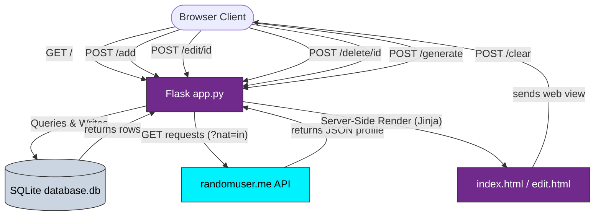

# Week 01–02: Student Registry Portal

A lightweight, server-side rendered **Student Registry Portal** built using **Flask, SQLite, HTML5, and CSS3** with **zero JavaScript**. The application handles full database CRUD (Create, Read, Update, Delete) operations, live search filtering, and fetches mock student records on-demand from a public REST API.

---

## 🛠️ Technology Stack


---

## 📐 Architecture & Flow

The application is structured entirely on server-side rendering (SSR). When database CRUD or API commands are triggered, the Flask controller performs the transaction and redirects (`302`) the user back to the index view, forcing a clean reload of the layout without any client-side JavaScript.



---

## 🔌 API Integration Details (The API Part)

The application consumes the public **RandomUser API** inside the Python backend to automatically seed and generate realistic mock student profiles.

* **API Endpoint**: `https://randomuser.me/api/?nat=in`
* **HTTP Method**: `GET` (handled on the server-side via Python's standard `urllib.request` library)

### Data Lifecycle & Mappings:
1. **Name & Email**: Extracted directly from the API response (`results[0]['name']['first']`, `['last']` and `['email']`).
2. **Phone Number**: Fetches the API's phone output (`results[0]['phone']`) and sanitizes formatting characters.
3. **Academic Roll Number**: Dynamically generated in Python relative to the randomly chosen course code (e.g., `CSE/2024/018`, `MCA/2025/082`).
4. **Semester Track**: Randomly maps the record to appropriate academic progression (e.g., `Semester V (3rd Year)`).
5. **Admission Date**: Captures the registration date timestamp from the API, normalizes it to ISO `YYYY-MM-DD` for SQLite database operations, and displays it in standard `DD-MM-YYYY` format in the UI.

This serves as a hands-on implementation of a Python/Flask backend acting as a **REST Client**—consuming external JSON structures, parsing payloads, and storing them in an SQL query layer.

---

## 🌟 Key Features

1. **Academic Database Registry**: Stores Roll Number, Student Name, Contact Details (Email & Phone), and Academic Details (Course Track & Current Semester).
2. **Standard HTTP CRUD operations**:
   - **Enrolment**: Insert manual records using standard HTML forms.
   - **Editing**: Dedicated, server-prepopulated student edit page.
   - **Deletion**: Expel/Delete students by record ID.
3. **Live Directory Search**: Filter names, emails, roll numbers, or semesters dynamically using SQL `LIKE` queries.
4. **Mock Seeding via Public REST API**: Request mock profile datasets dynamically from `randomuser.me` (filtered for regional names under the hood using the `nat=in` query parameter).
5. **Premium Academic Layout**: Styled with clean light-slate colors, a customized amethyst purple header table, and soft container shadows.

---

## 🚀 How to Setup and Run

### Prerequisites
- Python 3.x installed.
- Pip package manager.

### 1. Install Dependencies
Make sure Flask is installed in your python environment:
```bash
pip install flask
```

### 2. Launch the Application
Run the Flask server from within the `week 01-02` directory:
```bash
python app.py
```

### 3. Open in Browser
Once running, navigate to:
[http://127.0.0.1:5000](http://127.0.0.1:5000)

---

Made by [Rohan Laharwnni/https://github.com/rohanlahar)
